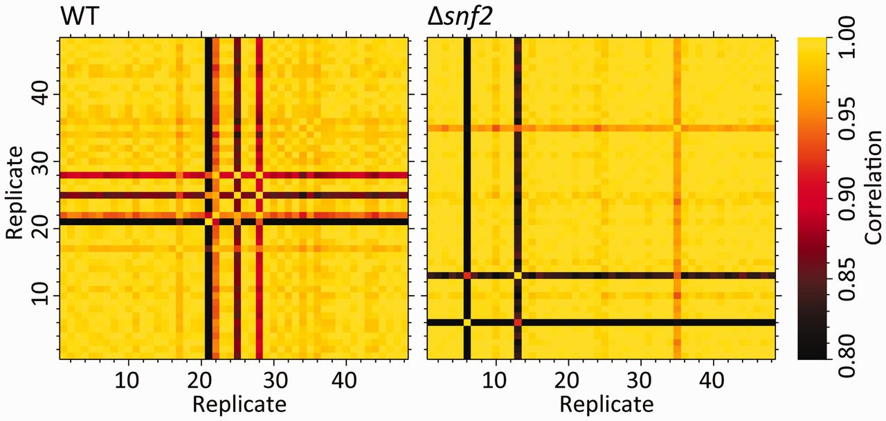

% reproducibility

# Authentication of Key Resources for Data Analysis

## TL;DR

NIH recently introduced a reproducibility initiative, extending to including the
"Authentication of Key Resources" page in grant applications from Jan 25, 2016.
Seems to be intended for grants involving biological reagents, but we included
it in our recent R03 grant developing new data analysis methods. We believe that
this type of thing should become common for all grants, not just those that use
biological/chemical resources.

## NIH and Reproducibility

There has been a lot of things published recently about the *reproducibility 
crisis* in science (see refs). The federal funding agencies are starting to 
respond to this, and beginning with grants submitted after January 25, 2016, 
grants are [supposed to address the
reproducibility](http://grants.nih.gov/reproducibility/index.htm) of the work
proposed, including the presence of various confounding factors (i.e. sex of
animals, the source of cell lines, etc). In addition to this, there is a new
document that can be added to grants, the [**Authentication
Plan**](http://nexus.od.nih.gov/all/2016/01/29/authentication-of-key-biological-andor-chemical-resources-in-nih-grant-applications/),
which as far as I can tell is intended specifically for:

> key biological and/or chemical resources used in the proposed studies

Now, this makes sense. Some sources of irreproducibility include, but are not 
limited to:

  * unvalidated antibodies 
  * cell lines that are not what was thought 
  * impure chemicals

I think this is a **good thing**. What does it have to do with data analysis?

## Data / Code Authentication

When we were submitting a recent R03 proposal for developing novel data analysis
methods and statistical tools, the grant management office asked us about the 
**Authentication of Key Resources** attachment, which we completely missed. Upon
review of the guidelines, we initially determined that this document did not
apply. However, we decided to go ahead and take some initiative.

### Data Authentication?

When dealing with multiple samples from high-throughput samples, there are
frequently a few easy ways to examine the data quality, and although it can be
hard to verify that the data **is what the supplier says it is**, which would be
true **authentication**, there are some ways to verify that the various samples
in the dataset are at least self-consistent within each sample class (normal and
disease, condition 1 and condition 2).

My go-to for data self-consistency are principal components analysis (PCA) and 
correlation heat-maps. Correlation heat-maps involve calculating 
all of the pairwise sample to sample correlations using all of the non-zero
sample features (those that are non-zero in the two pairs being compared). These
heatmaps, combined with the sample class information, and clustering within each
class, are a nice visual way to eyeball samples that have potential problems. A
simple example for RNA-seq transcriptomics was shown in [Gierliński et al., 
Statistical models for RNA-seq data derived from a two-condition 48-replicate
experiment Bioinformatics (2015) 31 (22): 3625-3630, Figure
1](https://dx.doi.org/10.1093/bioinformatics/btv425).

The other measures they used in this paper are also very nice, in plotting the 
median correlation of a sample against all other samples, and the fraction of 
outlier features in a given sample (see figure 2 of Gierlinkski et al). The
final measure they propose is not generally applicable to all -omics data
however.

PCA on the data, followed by visualizing the scores on the first few principal 
components, and colored by sample class (or experimental condition) is similar 
in spirit to the correlation heat-map. In fact, it is very similar, because PCA 
is actually decomposing on the covariance of the samples, which is very related
to the correlations (an early algorithm actually used the correlation matrix).

Both of these methods can highlight possible problems with individual samples,
and make sure that the set of data going into the analysis is at least
self-consistent, which is important when doing classification or differential
abundance analyses.

### Code Authentication

The other thing we highlighted in the document was **code** authentication. In 
this case, we highlighted the use of unit-testing in the R packages that we are 
planning to develop. Even though this is software coming out of a research lab,
we need to have confidence that the functions we write return the correct values
given various inputs. In addition, code testing coverage helps evaluate that we
are testing *all* of the functionality by checking that all of the lines in our
code are run by the tests. Finally, we are also planning to write tests for core
functions provided by others (i.e. functions in other R packages), in that they
work as we expect, by returning correct values given specific inputs.

## Conclusion

Going forward, I think it would be a good thing if people writing research grants
for data analysis methods would discuss how they are going to look at the data
to assess it's quality, and how they are going to do unit testing, and will have
to start saying that they are going to do unit testing of their analysis method.

I'd be interested in others' thoughts on this as well.
